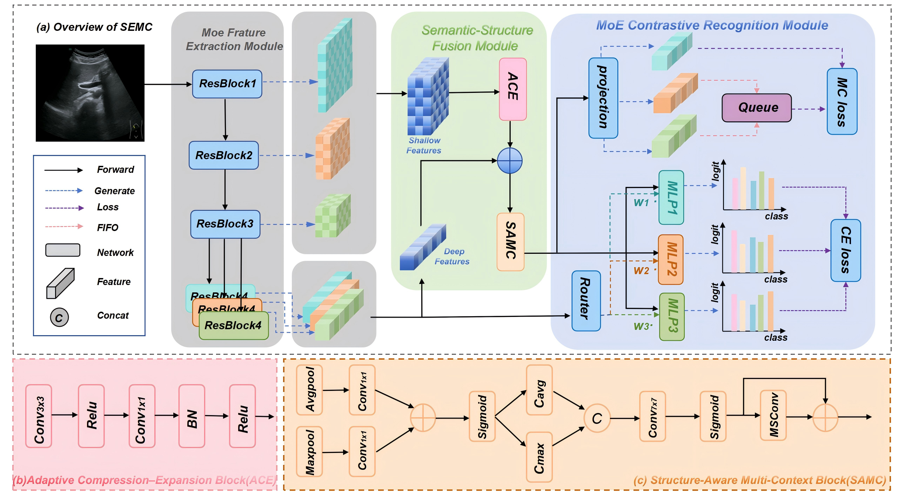

# SEMC

## Introduction

This is the implementation of **"SEMC: Structure-Enhanced Mixture-of-Experts Contrastive Learning for Ultrasound Standard Plane Recognition"**.
<p align="center">
  
</p>

## Requirements

- Python == 3.8  
- Install dependencies from `requirements.txt` using:

```bash
pip install -r requirements.txt
```

## Usage

**Updating...**
