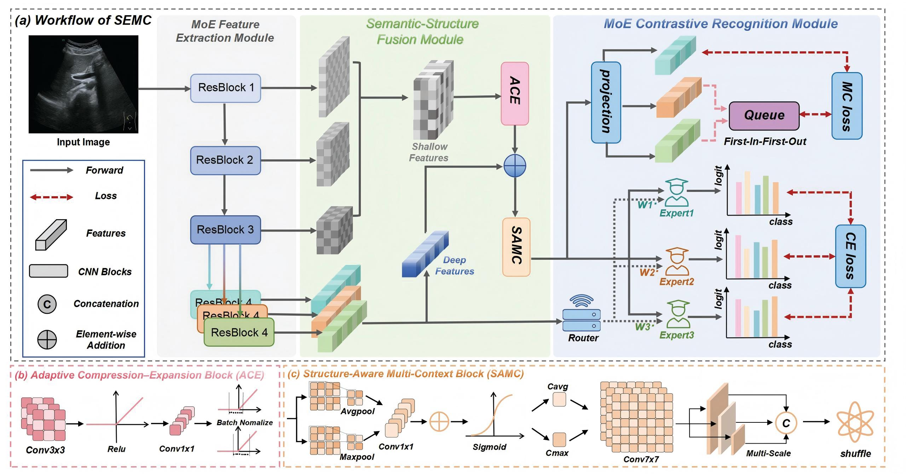

# SEMC

## Introduction

This is the implementation of **[SEMC: Structure-Enhanced Mixture-of-Experts Contrastive Learning for Ultrasound Standard Plane Recognition](https://doi.org/10.48550/arXiv.2511.12559)**.
<p align="center">
  
</p>

## Requirements

- Python == 3.8  
- Install dependencies from `requirements.txt` using:

```bash
pip install -r requirements.txt
```

## Dataset Preparation

Our collected **Liver Standard Plane Ultrasound Dataset (LP2025)** is available at the following link:

👉 **[Download the LP2025 Dataset](https://huggingface.co/datasets/yanguihao/lp2025/tree/main)**


## 🚀 Train
**Updating...**  (Training instructions and scripts are coming soon!)
