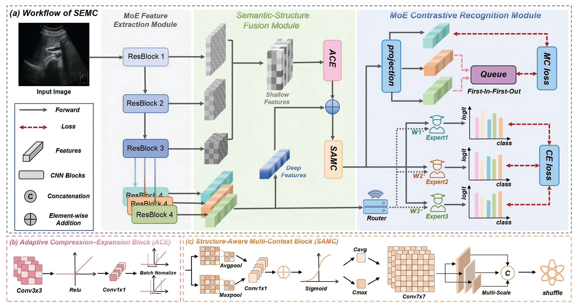

# 🌟 SEMC

## 📘 Introduction

This is the implementation of **[SEMC: Structure-Enhanced Mixture-of-Experts Contrastive Learning for Ultrasound Standard Plane Recognition](https://doi.org/10.48550/arXiv.2511.12559)**.
<p align="center">
  
</p>

## ⚙️ Requirements

- Python == 3.8  
- Install dependencies from `requirements.txt` using:

```bash
pip install -r requirements.txt
```

## 🗂️ Dataset Preparation

Our collected **Liver Standard Plane Ultrasound Dataset (LP2025)** is available at the following link:

👉 **[Download the LP2025 Dataset](https://huggingface.co/datasets/yanguihao/lp2025/tree/main)**


## 🚀 Train
To train the SEMC model, use the SEMC_train.py script. You can specify the dataset path, batch size, and epochs.
```bash
python ./code/SEMC_train.py \
  --dataset_path ./data/lp2025 \
  --batch_size 32 \
  --epochs 200
```
## ✅ Test
After training is complete, you can evaluate the model using the SEMC_test.py script. Make sure to specify the path to the trained checkpoint.
```bash
python ./code/SEMC_test.py
```
